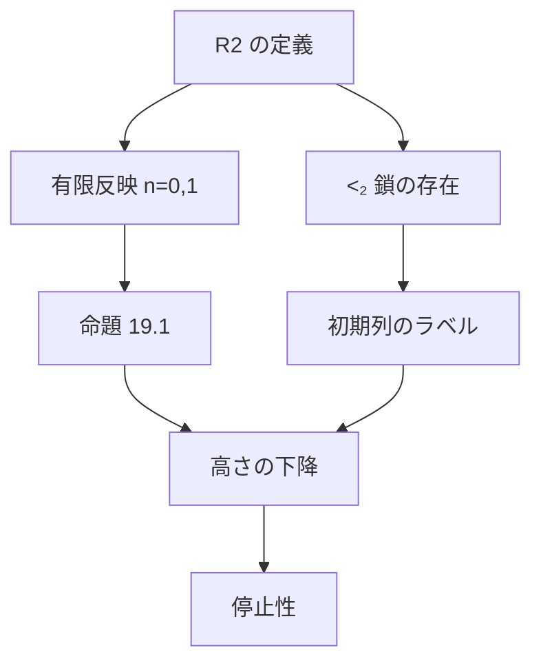

# Σ₂ 初等部分構造によるペア数列システムの停止性

ペア数列の展開がいつか必ず止まることを、Carlson の構造 R2 の関係をラベルに使って Lean 4 で証明した。
ラベルの関係の定義には、構成可能階層も許容順序数も使っていない。

## 結論

```lean
theorem Wilken.pss_terminates {A : Arr 2} (hA : PSS A) (n : ℕ → ℕ) :
    ∃ T, (seq A n T).len = 0

theorem Wilken.PR_wf : WellFounded PR
```

- `PSS A`：`A` は、ある `(0,0)(1,1)⋯(n,n)` から展開を有限回して得られる 2 行の配列
- `seq A n`：`A₀ = A`、`A_{t+1} = A_t[n t]`
- `PR A B`：`B` は空でなく、ある `n` で `A = B[n]`

`sorry` は無く、公理は `propext` / `Classical.choice` / `Quot.sound` のみ。

## 1. ペア数列

展開規則は BM4 の 2 行版で、[koteitan/dh-bms-wf-formal](https://github.com/koteitan/dh-bms-wf-formal) の `lean/Bm4/Defs.lean` の `expand` をそのまま使う。

BM4 の初期列 `E_2 = (0,0)(1,1)` から届くのは ε₀ 未満だけなので、初期列を `(0,0)(1,1)⋯(n,n)`（`stair n`）に広げた。

```lean
def stair (n : ℕ) : Arr 2 := ⟨n + 1, fun i _ => i⟩

inductive PSS : Arr 2 → Prop
  | init (n : ℕ) : PSS (stair n)
  | step {A : Arr 2} (N : ℕ) : PSS A → PSS (expand A N)
```

## 2. 証明の骨格

DH の証明と同じく、列ごとに順序数のラベルを 1 つ貼り、展開するとコピーには元より小さいラベルが付くことで、最後の列のラベル（高さ）が下がることを示す。
DH との違いは、ラベルの関係 `◁_k` を構成可能階層の初等部分構造ではなく、R2 の関係で与えることである。



## 3. R2

```
R2 = (Ord; ≤, ≤₁, ≤₂)

α ≤ᵢ β  :⟺  (α; ≤, ≤₁, ≤₂) が (β; ≤, ≤₁, ≤₂) の Σᵢ 初等部分構造      (i = 1, 2)
α <ᵢ β  :⟺  α < β かつ α ≤ᵢ β
```

`≤₁` と `≤₂` は、β についての帰納法で同時に定義する。

Lean では論理式を構文にしない。

- `n` 変数の量化子なし論理式は、`n` 組の原子図式（各 2 点について `≤`、`≤₁`、`≤₂` の真偽）の集合 `D` で表す
- Σ₂ 文 `∃x₀…x_{m−1} ∀y₀…y_{l−1} ψ`（パラメータ `p₀…p_{k−1}`）は `Sat R2 M k m l D p` で表す。Σ₁ 文は `l = 0` の場合
- 再帰は `R2fix` で整礎再帰として定義し、定義の等式を `le1_iff`、`le2_iff` で取り出す

基本性質（`R2.lean`）：

| 性質 | Lean |
|---|---|
| `a ≤₂ b ⇒ a ≤₁ b` | `le1_of_le2` |
| 推移律 | `le1_trans`, `le2_trans` |
| `a ≤ b ≤ c` かつ `a ≤₁ c` ⇒ `a ≤₁ b` | `le1_of_le_of_le1` |
| `v ∈ [y, α)` のすべてで `y ≤₁ v`、α が後続で閉じる ⇒ `y ≤₁ α` | `le1_of_forall` |
| `α <₁ β` ⇒ α は後続で閉じる | `succ_lt_of_lt1` |

## 4. ラベルの関係と有限反映

```
◁₀ = <₁,   ◁₁ = <₂
```

命題 19.1 がラベルに要求するのは、`◁_k` が狭義で推移的であることと、次の有限反映だけである（`Label.lean` の `LabelSystem 2`）。

```
n < 2,  α ◁_n β,  X ⊆ α は有限,  α ≤ y_0 < ⋯ < y_{s−1} < β  のとき
∃ y'_0 < ⋯ < y'_{s−1} < α で
  (a) max X < y'_0
  (b) x ◁_k y_i   ⇒ x ◁_k y'_i       (x ∈ X, k < 2)
  (c) y_i ◁_k y_j ⇒ y'_i ◁_k y'_j    (k < 2)
  (d) y_i ◁_m β   ⇒ y'_i ◁_m α       (m < n)
```

**n = 0 のとき**（`reflect_zero`）：Σ₁ 文「X の上に、X ∪ Y と同じ原子図式を持つ点の組がある」は β で真なので、`α <₁ β` により α でも真になる。その証人が y' で、(a)(b)(c) は原子図式が同じことから出る。

**n = 1 のとき**（`reflect_one`）：上の文に、`y_i <₁ β` となる各 i について

```
∀v (u_i ≤ v → u_i ≤₁ v)
```

を足した Σ₂ 文を使う。

1. β で真：`y_i ≤₁ β` と `y_i ≤ v < β` から `y_i ≤₁ v`（`le1_of_le_of_le1`）
2. `α <₂ β` により α でも真。証人 u_i = y'_i は、`v ∈ [y'_i, α)` のすべてで `y'_i ≤₁ v`
3. α は後続で閉じるので、連続性から `y'_i <₁ α`（`le1_of_forall`）。これが (d)

これは Wilken の論文 "Pure Σ2-elementarity beyond the core" の補題 1.7 と同じ内容である。

## 5. 初期列のラベル

`(0,0)(1,1)⋯(n,n)` には、長さ `n+1` の `<₂` 鎖をそのままラベルとして貼る（`stable_stair`）。
すべての列の組が `<₂` で結ばれ、`<₂ ⊆ <₁` なので、行 0 と行 1 のどちらの祖先関係も満たす。

`<₂` 鎖が存在することは、ω₁ の中の閉包で示す（`Chain.lean`）。

```
next γ   = γ と、「パラメータが γ 未満で ω₁ で真な Σ₂ 文」の証人の上限の、次の順序数
lam γ    = sup { γ, next γ, next (next γ), … }

γ < ω₁ ⇒ γ < lam γ < ω₁                                          (lt_lam, lam_lt)
γ < ω₁ ⇒ (lam γ; ≤, ≤₁, ≤₂) ≼_Σ₂ (ω₁; ≤, ≤₁, ≤₂)                  (lam_elem)
lam γ < lam δ（γ, δ < ω₁）⇒ lam γ <₂ lam δ                        (lt2_lam)
lam 0 < lam (lam 0) < ⋯ は <₂ 鎖                                   (exists_lt2_chain)
```

- `next γ < ω₁` になるのは、「論理式とパラメータの組」の全体が可算なので、証人の上限が可算個の上限になるからである（`Ordinal.iSup_lt_omega_one`）
- `lam_elem` は Tarski–Vaught の判定と同じ議論である
  - ω₁ で真な Σ₂ 文は、`lam γ` の中に証人を持つ（`lam_down`）
  - 逆向きは、∀ 部分の反例を Σ₁ 文にして `lam_down` を使う

## 6. 高さの下降と停止性

DH の命題 19.1（`Label.lean` の `descent`）をそのまま使う。
安定ラベル f を持つ空でない配列を展開すると、空でなければ、高さが f より小さい安定ラベル g を持つ。

- `pss_stable`：`PSS A` で空でない A は安定ラベルを持つ。初期列には §5、展開には `descent` を使う
- `pss_terminates`：展開列が空にならないとすると、`descent` で高さが無限に下がる列が作れ、順序数の整礎性に反する
- `PR_wf`：無限降下列は `seq` の形なので、`pss_terminates` に帰着する

## 7. 形式化していないこと

- **ラベルが小さいこと**
  - Lean の証明は、`<₂` 鎖を ω₁ の中の閉包で作っているので、ラベルがどれくらいの大きさかは示していない
  - Wilken によれば、有限の `≤₂` 鎖がいくらでも長くとれる最小の順序数は、Π¹₁-CA₀ の証明論的順序数 ψ₀(Ω_ω) である（下の "Tracking chains revisited" の序文）。この場合、ラベルは ψ₀(Ω_ω) 未満の再帰的順序数に取れて、許容順序数ではない
  - この事実は形式化していない
- **他の版のペア数列との一致**：扱うのは BM4 の 2 行版だけである
- **3 行以上**
  - (d) に `m = 1` の条件「`y_i <₂ β ⇒ y'_i <₂ α`」が加わる
  - `≤₂` は `≤` に沿っては閉じていないので、§4 の n = 1 の方法はそのままでは使えない

## 8. ファイル

| ファイル | 行数 | 内容 |
|---|---:|---|
| [`lean/Wilken/R2.lean`](../lean/Wilken/R2.lean) | 280 | R2 の定義と基本性質 |
| [`lean/Wilken/Reflect.lean`](../lean/Wilken/Reflect.lean) | 199 | 有限反映、`labelSystem` |
| [`lean/Wilken/Chain.lean`](../lean/Wilken/Chain.lean) | 242 | `<₂` 鎖の存在 |
| [`lean/Wilken/PSS.lean`](../lean/Wilken/PSS.lean) | 96 | ペア数列の定義、停止性、整礎性 |
| `lean/Bm4/` | 2,923 | BM4 の組合せ部分（配列、展開、コピー補題、命題 19.1） |

`lean/Bm4/` は [koteitan/dh-bms-wf-formal](https://github.com/koteitan/dh-bms-wf-formal) の `lean/Bm4/` から、組合せ部分だけ（`Defs`、`Basic`、`Copy`、`CopyPaper/*`、`Expand`、`Label`）をコピーした。
変更したのは `Label.lean` のラベル界面 `LabelSystem` だけである。

- 行数 `r` を構造の引数にし、有限反映は `n < r` の場合だけを要求する
- 使われていない `rel_mono` と、初期列 `E r` のためだけの `init` を外した

3 行以上では §4 の方法がそのままでは使えない（§7）ので、行数を固定した界面にした。

## 9. ビルド

Lean 4.30.0 と Mathlib v4.30.0 を使う。

```sh
cd lean
lake exe cache get
lake build
```

## 出典

- G. Wilken, Pure Σ2-elementarity beyond the core, Annals of Pure and Applied Logic 172 (2021). https://doi.org/10.1016/j.apal.2021.103001
- G. Wilken, Tracking chains revisited. https://arxiv.org/abs/1611.04348
- G. Wilken, Pure patterns of order 2. https://arxiv.org/abs/1608.08421
- T. J. Carlson and G. Wilken, Tracking chains of Σ2-elementarity, Annals of Pure and Applied Logic 163 (2012).
