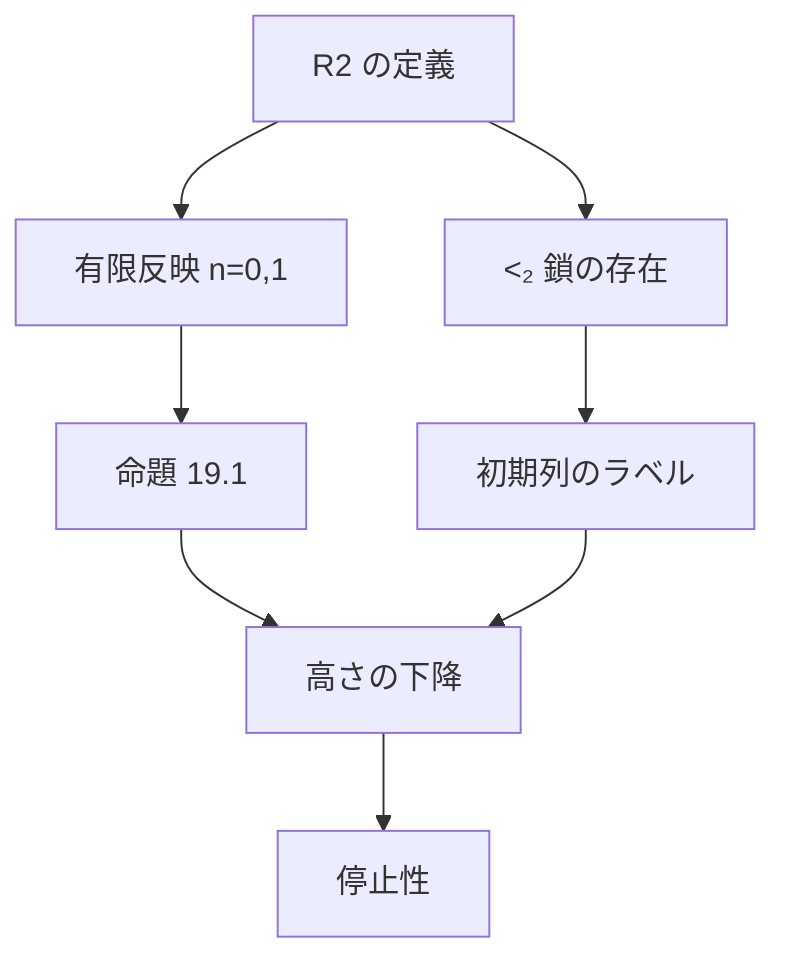

# Σ₂ 初等部分構造によるペア数列システムの停止性の証明

ペア数列の展開がいつか必ず止まることを、Carlson の構造 $`\mathcal{R}_2`$ の関係をラベルに使って Lean 4 で証明した。
ラベルの関係の定義には、構成可能階層も許容順序数も使っていない。

3 行（トリオ数列）への拡張は [TSS.md](TSS.md) にある。Lean のコードは 1〜3 行をまとめて扱う。

## 結論

**定理（停止性）.** $`A`$ をペア数列、$`n : \mathbb{N} \to \mathbb{N}`$ を任意の関数とし、

```math
A_0 = A, \qquad A_{t+1} = A_t[n(t)]
```

と置く。このとき、ある $`T`$ で $`A_T`$ は空である。

**定理（整礎性）.** ペア数列の上の関係

```math
A \mathrel{R} B \iff B \ne \emptyset \wedge \exists n\ \bigl(A = B[n]\bigr)
```

は整礎である。

Lean の証明に `sorry` は無く、公理は `propext` / `Classical.choice` / `Quot.sound` のみ。

## 1. ペア数列

展開規則は BM4 の 2 行版で、[koteitan/dh-bms-wf-formal](https://github.com/koteitan/dh-bms-wf-formal) の展開をそのまま使う。

BM4 の初期列 $`E_2 = (0,0)(1,1)`$ から届くのは $`\varepsilon_0`$ 未満だけなので、初期列を次のように広げた。

```math
S_n = (0,0)(1,1)\cdots(n,n)
```

**定義.** ペア数列とは、ある $`S_n`$ から展開を有限回して得られる 2 行の配列のことである。

## 2. 証明の骨格

DH の証明と同じく、列ごとに順序数のラベルを 1 つ貼り、展開するとコピーには元より小さいラベルが付くことで、最後の列のラベル（高さ）が下がることを示す。
DH との違いは、ラベルの関係 $`\lhd_k`$ を構成可能階層の初等部分構造ではなく、$`\mathcal{R}_2`$ の関係で与えることである。



## 3. R2

```math
\mathcal{R}_2 = (\mathrm{Ord}; \le, \le_1, \le_2)
```

```math
\alpha \le_i \beta \iff (\alpha; \le, \le_1, \le_2) \preceq_{\Sigma_i} (\beta; \le, \le_1, \le_2) \qquad (i = 1, 2)
```

```math
\alpha \lt_i \beta \iff \alpha \lt \beta \wedge \alpha \le_i \beta
```

$`\le_1`$ と $`\le_2`$ は、$`\beta`$ についての帰納法で同時に定義する。

Lean では論理式を構文にしない。

- $`n`$ 変数の量化子なし論理式は、$`n`$ 組の原子図式の集合 $`D`$ で表す。$`n`$ 組 $`v`$ の原子図式は、各 $`a, b \lt n`$ に次の真偽の組を対応させるものである。

```math
\mathrm{diag}(v)(a, b) = \bigl( [v_a \le v_b],\ [v_a \le_1 v_b],\ [v_a \le_2 v_b] \bigr)
```

- パラメータ $`\vec p`$ を持つ $`\Sigma_2`$ 文は、次の形で表す。$`\Sigma_1`$ 文は $`\vec y`$ のブロックが無い場合である。

```math
M \models \exists \vec x\ \neg\, \exists \vec y\ \neg\, \bigl(\mathrm{diag}(\vec p, \vec x, \vec y) \in D\bigr)
```

基本性質：

| 性質 |
|---|
| $`a \le_2 b \Rightarrow a \le_1 b`$ |
| $`\le_1`$ と $`\le_2`$ は推移的 |
| $`a \le b \le c \wedge a \le_1 c \Rightarrow a \le_1 b`$ |
| $`y \le \alpha`$、$`\alpha`$ が後続で閉じ、$`\forall v \in [y, \alpha)\ y \le_1 v`$ $`\Rightarrow y \le_1 \alpha`$ |
| $`\alpha \lt_1 \beta \Rightarrow \forall z \lt \alpha\ (z + 1 \lt \alpha)`$ |

## 4. ラベルの関係と有限反映

```math
\lhd_0 = \lt_1, \qquad \lhd_1 = \lt_2
```

命題 19.1 がラベルに要求するのは、$`\lhd_k`$ が狭義で推移的であることと、次の有限反映だけである。

**有限反映.** $`n \lt 2`$、$`\alpha \lhd_n \beta`$、$`X \subseteq \alpha`$ は有限、$`\alpha \le y_0 \lt \cdots \lt y_{s-1} \lt \beta`$ とする。このとき $`y'_0 \lt \cdots \lt y'_{s-1} \lt \alpha`$ で、次の (a)〜(d) を満たすものがある。

```math
\max X \lt y'_0 \qquad \text{(a)}
```

```math
\forall x \in X\ \forall i \lt s\ \forall k \lt 2\ \bigl(x \lhd_k y_i \Rightarrow x \lhd_k y'_i\bigr) \qquad \text{(b)}
```

```math
\forall i, j \lt s\ \forall k \lt 2\ \bigl(y_i \lhd_k y_j \Rightarrow y'_i \lhd_k y'_j\bigr) \qquad \text{(c)}
```

```math
\forall i \lt s\ \forall m \lt n\ \bigl(y_i \lhd_m \beta \Rightarrow y'_i \lhd_m \alpha\bigr) \qquad \text{(d)}
```

**$`n = 0`$ のとき.** $`\Sigma_1`$ 文「$`X`$ の上に、$`X \cup Y`$ と同じ原子図式を持つ点の組がある」は $`\beta`$ で真なので、$`\alpha \lt_1 \beta`$ により $`\alpha`$ でも真になる。その証人が $`y'`$ で、(a)(b)(c) は原子図式が同じことから出る。(d) は $`m \lt 0`$ なので空である。

**$`n = 1`$ のとき.** 上の文に、$`y_i \lt_1 \beta`$ となる各 $`i`$ について

```math
\forall v_i\ \bigl(u_i \le v_i \Rightarrow u_i \le_1 v_i\bigr)
```

を足した $`\Sigma_2`$ 文を使う。

1. $`\beta`$ で真：$`y_i \le_1 \beta`$ と $`y_i \le v \lt \beta`$ から $`y_i \le_1 v`$
2. $`\alpha \lt_2 \beta`$ により $`\alpha`$ でも真。証人 $`u_i = y'_i`$ は、すべての $`v \in [y'_i, \alpha)`$ で $`y'_i \le_1 v`$
3. $`\alpha`$ は後続で閉じるので、連続性から $`y'_i \lt_1 \alpha`$。これが (d)

これは Wilken の論文 "Pure Σ2-elementarity beyond the core" の補題 1.7 と同じ内容である。

## 5. 初期列のラベル

$`S_n`$ には、長さ $`n+1`$ の $`\lt_2`$ 鎖

```math
c_0 \lt_2 c_1 \lt_2 \cdots \lt_2 c_n
```

をそのままラベルとして貼る。すべての列の組が $`\lt_2`$ で結ばれ、$`\lt_2 \subseteq \lt_1`$ なので、行 0 と行 1 のどちらの祖先関係も満たす。

$`\lt_2`$ 鎖があることは、$`\omega_1`$ の中の閉包で示す。

パラメータが $`\gamma`$ 未満で $`\omega_1`$ で真な文のそれぞれについて、最初のブロックの証人を 1 つ選び、その成分に $`+1`$ したもの全体の上限を取る。これと $`\gamma`$ の大きいほうに $`+1`$ したものを $`\mathrm{next}(\gamma)`$ とする。

```math
\lambda(\gamma) = \sup_{t \lt \omega} \mathrm{next}^t(\gamma)
```

このとき次が成り立つ。

```math
\gamma \lt \omega_1 \Rightarrow \gamma \lt \lambda(\gamma) \lt \omega_1
```

- $`\gamma \lt \omega_1`$ なら、パラメータが $`\lambda(\gamma)`$ 未満の文の真偽は、$`\lambda(\gamma)`$ と $`\omega_1`$ ですべて一致する

```math
\gamma, \delta \lt \omega_1 \wedge \lambda(\gamma) \lt \lambda(\delta) \Rightarrow \lambda(\gamma) \lt_2 \lambda(\delta)
```

```math
\lambda(0) \lt_2 \lambda(\lambda(0)) \lt_2 \lambda(\lambda(\lambda(0))) \lt_2 \cdots
```

- $`\mathrm{next}(\gamma) \lt \omega_1`$ になるのは、論理式とパラメータの組の全体が可算なので、証人の上限が $`\omega_1`$ 未満の順序数の可算個の上限になるからである
- 真偽の一致は、ブロックの数についての帰納法で示す。$`\omega_1`$ で真な文の最初のブロックの証人は、$`\lambda(\gamma)`$ の中にある
- $`\lambda(\gamma) \lt_2 \lambda(\delta)`$ は、どちらも $`\omega_1`$ と文の真偽が一致することから出る

## 6. 高さの下降と停止性

配列 $`A`$ の長さを $`\ell`$、ラベルを $`f`$ とするとき、高さを $`\mathrm{ht}(f) = f(\ell - 1)`$ と置く。

**命題 19.1（DH）.** 安定ラベル $`f`$ を持つ空でない配列 $`A`$ と $`N \in \mathbb{N}`$ について、$`A[N]`$ が空でなければ、$`A[N]`$ は安定ラベル $`g`$ で

```math
\mathrm{ht}(g) \lt \mathrm{ht}(f)
```

となるものを持つ。

これは dh-bms-wf-formal で有限反映を仮定して証明されたものを、そのまま使う。

- 空でないペア数列は安定ラベルを持つ。初期列には §5、展開には命題 19.1 を使う
- 展開列が空にならないとすると、命題 19.1 で高さが無限に下がる順序数の列が作れ、順序数の整礎性に反する。これが停止性である
- $`R`$ の無限降下列は展開列の形なので、整礎性は停止性に帰着する

## 7. 形式化していないこと

- **ラベルが小さいこと**
  - Lean の証明は、$`\lt_2`$ 鎖を $`\omega_1`$ の中の閉包で作っているので、ラベルがどれくらいの大きさかは示していない
  - Wilken によれば、有限の $`\le_2`$ 鎖がいくらでも長くとれる最小の順序数は、$`\Pi^1_1\text{-}\mathrm{CA}_0`$ の証明論的順序数 $`\psi_0(\Omega_\omega)`$ である（下の "Tracking chains revisited" の序文）。この場合、ラベルは $`\psi_0(\Omega_\omega)`$ 未満の再帰的順序数に取れて、許容順序数ではない
  - この事実は形式化していない
- **他の版のペア数列との一致**：扱うのは BM4 の 2 行版だけである
- **3 行以上**
  - 3 行では (d) に $`m = 1`$ の条件 $`y_i \lt_2 \beta \Rightarrow y'_i \lt_2 \alpha`$ が加わる
  - $`\mathcal{R}_3`$ を使うと示せる。[TSS.md](TSS.md) にある
  - 4 行以上は扱っていない

## 8. Lean との対応

Lean では $`\mathcal{R}_N`$ を一般の $`N`$ で定義している。ペア数列は $`N = 2`$ の場合である。

| 数学 | Lean | ファイル |
|---|---|---|
| $`\le_1`$、$`\le_2`$ の定義 | `RFix`, `RN`, `lev`, `lev_iff` | [`Basic.lean`](../lean/Pattern/Basic.lean) |
| $`\lt_1`$、$`\lt_2`$ | `lab` | 同上 |
| 論理式、原子図式 | `Sig`, `diag`, `Elem` | 同上 |
| 推移律、$`\le_2 \Rightarrow \le_1`$ | `lev_trans`, `lev_mono` | 同上 |
| $`a \le b \le c \wedge a \le_1 c \Rightarrow a \le_1 b`$ | `lev0_of_le` | 同上 |
| 連続性 | `lev0_of_forall` | 同上 |
| $`\alpha \lt_1 \beta`$ なら後続で閉じる | `succ_lt_of_lab0` | 同上 |
| 有限反映 $`n = 0`$ | `reflect_zero` | [`Reflect.lean`](../lean/Pattern/Reflect.lean) |
| 有限反映 $`n = 1`$ | `reflect_one` | 同上 |
| ラベルの体系 | `labelSystem` | 同上 |
| $`\mathrm{next}`$、$`\lambda`$ | `next`, `lam` | [`Chain.lean`](../lean/Pattern/Chain.lean) |
| $`\lambda(\gamma)`$ と $`\omega_1`$ の一致 | `lam_elem` | 同上 |
| $`\lambda(\gamma) \lt_2 \lambda(\delta)`$ | `lab_lam` | 同上 |
| 鎖の存在 | `exists_chain` | 同上 |
| $`S_n`$、ペア数列 | `stair`, `Std` | [`Main.lean`](../lean/Pattern/Main.lean) |
| $`S_n`$ のラベル | `stable_stair` | 同上 |
| 空でないペア数列のラベル | `std_stable` | 同上 |
| 停止性 | `pss_terminates`（一般形 `terminates`） | 同上 |
| 整礎性 | `StdR_wf` | 同上 |
| 命題 19.1 | `descent` | [`Bm4/Label.lean`](../lean/Bm4/Label.lean) |

## 9. ファイル

| ファイル | 行数 | 内容 |
|---|---:|---|
| [`lean/Pattern/Basic.lean`](../lean/Pattern/Basic.lean) | 454 | $`\mathcal{R}_N`$ の定義と基本性質 |
| [`lean/Pattern/Reflect.lean`](../lean/Pattern/Reflect.lean) | 329 | 有限反映（$`n = 0, 1, 2`$）、ラベルの体系 |
| [`lean/Pattern/Chain.lean`](../lean/Pattern/Chain.lean) | 209 | すべての段で結ばれた鎖の存在 |
| [`lean/Pattern/Main.lean`](../lean/Pattern/Main.lean) | 111 | 標準列の定義、1〜3 行の停止性、整礎性 |
| `lean/Bm4/` | 2,923 | BM4 の組合せ部分（配列、展開、コピー補題、命題 19.1） |

`lean/Bm4/` は [koteitan/dh-bms-wf-formal](https://github.com/koteitan/dh-bms-wf-formal) の `lean/Bm4/` から、組合せ部分だけをコピーした。
変更したのは `Label.lean` のラベルの界面だけである。

- 行数 $`r`$ を界面の引数にし、有限反映は $`n \lt r`$ の場合だけを要求する
- 使われていない単調性の条件と、初期列 $`E_r`$ のためだけの初期対の条件を外した

4 行以上では有限反映を示していないので、行数を固定した界面にした。

## 10. ビルド

Lean 4.30.0 と Mathlib v4.30.0 を使う。

```sh
cd lean
lake exe cache get
lake build
```

## 出典

- G. Wilken, Pure Σ2-elementarity beyond the core, Annals of Pure and Applied Logic 172 (2021). https://doi.org/10.1016/j.apal.2021.103001
- G. Wilken, Tracking chains revisited. https://arxiv.org/abs/1611.04348
- G. Wilken, Pure patterns of order 2. https://arxiv.org/abs/1608.08421
- T. J. Carlson and G. Wilken, Tracking chains of Σ2-elementarity, Annals of Pure and Applied Logic 163 (2012).
