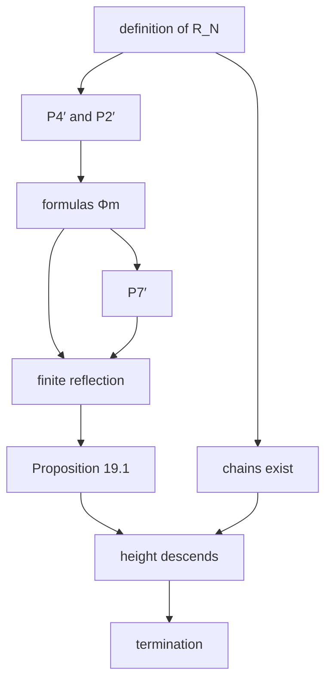

[← Back](../../README-en.md) | [English](README-en.md) | [Japanese](README.md)

# Termination Proof of the Bashicu Matrix System for Every Number of Rows via Σₙ-Elementary Substructures

We prove in Lean 4, for every $`r`$, that every expansion (BM4) of a Bashicu matrix with $`r`$ rows eventually terminates.
The label relations are the relations $`\lt_1, \dots, \lt_r`$ of Carlson's structure $`\mathcal{R}_r`$.

This extends [the proof for pair sequences](../pss/README-en.md) ($`\mathcal{R}_2`$) and [the proof for trio sequences](../tss/README-en.md) ($`\mathcal{R}_3`$) to every number of rows.
The new part is finite reflection at every level. The rest is the same as the proof for pair sequences.

## Result

**Theorem (termination).** Let $`r`$ be any natural number, $`A`$ a standard array with $`r`$ rows and $`n : \mathbb{N} \to \mathbb{N}`$ an arbitrary function, and put

```math
A_0 = A, \qquad A_{t+1} = A_t[n(t)]
```

Then $`A_T`$ is empty for some $`T`$.

**Theorem (well-foundedness).** The relation on standard arrays with $`r`$ rows

```math
A \mathrel{R} B \iff B \ne \emptyset \wedge \exists n\ \bigl(A = B[n]\bigr)
```

is well-founded.

The Lean proof contains no `sorry`, and its only axioms are `propext` / `Classical.choice` / `Quot.sound`. There is no assumption on the number of rows.

## Mathematical background

We assume the following notes for pair sequences.

| Note | What is used |
|---|---|
| [pss 01 Ordinals and ω₁](../pss/en/01-ordinals.md) | Infinite descending sequences, closure under successor, ω₁ |
| [pss 02 Structures and elementary substructures](../pss/en/02-elementary-substructure.md) | Formulas, Σₙ-elementary substructures, how formulas are represented in Lean |
| [pss 03 R_N](../pss/en/03-patterns.md) | Definition and basic properties of $`\mathcal{R}_N`$ |
| [pss 04 Properties P1–P7 of R_N](../pss/en/04-pattern-properties.md) | P1, P3, P4 (levels 1, 2), P5, P6, P7 |
| [pss 05 Arrays, expansion, and stable labels](../pss/en/05-arrays-labels.md) | Label systems, Proposition 19.1 |
| [pss 06 Finite reflection](../pss/en/06-finite-reflection.md) | §2 copy lemma, §3 $`n = 0`$, §4 $`n = 1`$ |
| [pss 07 Closure inside ω₁ and chains](../pss/en/07-closure-chains.md) | Chains related at every level |

Notes for every number of rows. They can be read from top to bottom.

| Note | Contents |
|---|---|
| [01 P4′ and P2′](en/01-cofinal-continuity.md) | Continuity and closure at every level |
| [02 The formulas Φₘ](en/02-phi.md) | Formulas that express the connection to the top from inside, Lemmas A and B |
| [03 Writing coordinatewise conditions in block form](en/03-block-form.md) | The sentences used can be written in Lean's form of formulas |
| [04 P7′](en/04-cofinal-predecessors.md) | Predecessors at every level are unbounded at the lower end |
| [05 Finite reflection at every level](en/05-finite-reflection.md) | Finite reflection, the label system |
| [06 Termination and well-foundedness](en/06-termination.md) | Labels of the initial arrays, termination, well-foundedness |

## 1. Standard arrays

```math
S^r_n = \underbrace{(0,\dots,0)}_{r}\,\underbrace{(1,\dots,1)}_{r} \cdots \underbrace{(n,\dots,n)}_{r}
```

**Definition.** A standard array with $`r`$ rows is an array with $`r`$ rows obtained from some $`S^r_n`$ by finitely many expansions. The expansion rule is BM4, and we use the expansion of [koteitan/dh-bms-wf-formal](https://github.com/koteitan/dh-bms-wf-formal) as it is.

The BM4 initial array $`E_r = (0, \dots, 0)(1, \dots, 1)`$ is $`S^r_1`$, so every array obtained from $`E_r`$ by expansions is a standard array with $`r`$ rows.

## 2. Outline of the proof



## 3. Label relations and finite reflection

```math
\lhd_k = \lt_{k+1} \qquad (k \lt r)
```

Proposition 19.1 requires of the labels only that $`\lhd_k`$ are strict and transitive, and the following finite reflection.

**Finite reflection.** Let $`n \lt r`$, $`\alpha \lhd_n \beta`$, $`X \subseteq \alpha`$ finite, and $`\alpha \le y_0 \lt \cdots \lt y_{s-1} \lt \beta`$. Then there are $`y'_0 \lt \cdots \lt y'_{s-1} \lt \alpha`$ satisfying (a)–(d).

```math
\max X \lt y'_0 \qquad \text{(a)}
```

```math
\forall x \in X\ \forall i \lt s\ \forall k \lt r\ \bigl(x \lhd_k y_i \Rightarrow x \lhd_k y'_i\bigr) \qquad \text{(b)}
```

```math
\forall i, j \lt s\ \forall k \lt r\ \bigl(y_i \lhd_k y_j \Rightarrow y'_i \lhd_k y'_j\bigr) \qquad \text{(c)}
```

```math
\forall i \lt s\ \forall m \lt n\ \bigl(y_i \lhd_m \beta \Rightarrow y'_i \lhd_m \alpha\bigr) \qquad \text{(d)}
```

Up to 3 rows, $`n \le 2`$ were shown one by one. For every number of rows, all $`n`$ are shown by one proof ([05](en/05-finite-reflection.md)).

**Outline for $`n \ge 1`$.** Let $`\alpha \lt_{n+1} \beta`$ and $`M_i = \{m \lt n : y_i \lt_{m+1} \beta\}`$. We use the $`\Sigma_{n+1}`$ sentence

```math
\sigma = \exists \vec U\ \forall \vec V\ \Bigl(\mathrm{diag}(X, \vec U) = \mathrm{diag}(X, \vec y) \wedge \bigwedge_{i \lt s} \bigl(U_i \le V_i \wedge \Phi_{n-1}(V_i) \Rightarrow \bigwedge_{m \in M_i} U_i \le_{m+1} V_i\bigr)\Bigr)
```

$`\Phi_{n-1}(V_i)`$ is a $`\Pi_{n-1}`$ formula that says from inside the structure that "$`V_i`$ is $`\le_{n-1}`$-connected to the top" ([02](en/02-phi.md)).

1. True in $`\beta`$: $`\vec U = \vec y`$, by the corollary of [01](en/01-cofinal-continuity.md)
2. $`\alpha \lt_{n+1} \beta`$ makes it true in $`\alpha`$. For a witness $`\vec y'`$, the agreement of atomic diagrams gives (a), (b), (c)
3. (d): by P7′, take $`\le_{n-1}`$-predecessors $`v`$ of $`\alpha`$ unboundedly. Putting $`V_i = v`$ into $`\sigma`$ gives $`y'_i \le_{m+1} v`$, and P4′ gives $`y'_i \le_{m+1} \alpha`$

## 4. Properties used

The properties at levels 1 and 2 are in [pss 04](../pss/en/04-pattern-properties.md). Their extensions to every level are the following. Read $`\le_0`$, $`\le_{-1}`$ as $`\le`$.

| | Property | Note |
|---|---|---|
| P4′ | $`y \lt \alpha`$, $`S \subseteq [y, \alpha)`$ unbounded in $`\alpha`$, $`\forall v \in S\ (y \le_j v \wedge v \le_{j-2} \alpha)`$ $`\Rightarrow y \le_j \alpha`$ | [01](en/01-cofinal-continuity.md) |
| P2′ | $`a \le b \le c`$, $`a \le_m b \le_m c`$, $`a \le_{m+1} c`$ $`\Rightarrow a \le_{m+1} b`$ | [01](en/01-cofinal-continuity.md) |
| Corollary | $`u \le s \le \gamma`$, $`u \le_m \gamma`$, $`s \le_{m-1} \gamma`$ $`\Rightarrow u \le_m s`$ | [01](en/01-cofinal-continuity.md) |
| Lemma A | $`\gamma`$ closed under successor, $`\gamma \models \Phi_m(u)`$ $`\Rightarrow u \le_m \gamma`$ | [02](en/02-phi.md) |
| Lemma B | $`u \le_m \gamma`$, $`\forall i \lt m\ \mathrm{Cof}_i(\gamma)`$ $`\Rightarrow \gamma \models \Phi_m(u)`$ | [02](en/02-phi.md) |
| P7′ | $`\alpha \lt_{m+1} \beta \Rightarrow \forall i \le m\ \mathrm{Cof}_i(\alpha)`$ | [04](en/04-cofinal-predecessors.md) |

$`\mathrm{Cof}_i(\gamma)`$ says that the $`\le_i`$-predecessors of $`\gamma`$ are unbounded in $`\gamma`$.

## 5. Labels of the initial arrays and termination

- $`S^r_n`$ is labelled directly by the chain of [pss 07](../pss/en/07-closure-chains.md), related at every level
- Every nonempty standard array has a stable label by Proposition 19.1
- If an expansion sequence never becomes empty, Proposition 19.1 produces an infinite descending sequence of heights, contradicting the well-foundedness of the ordinals. This is termination
- An infinite descending sequence of $`R`$ has the form of an expansion sequence, so well-foundedness reduces to termination

## 6. What is not formalized

- **Size of the labels**: the labels are built by a closure inside $`\omega_1`$, so we only show that they are below $`\omega_1`$
- **Agreement with other versions of the Bashicu matrix**: only the BM4 expansion rule is treated

## 7. Correspondence with Lean

Lean's level numbers are shifted by one (`lev N 0` is $`\le_1`$, `lab N 0` is $`\lt_1`$).

| Mathematics | Lean | File |
|---|---|---|
| P4′ | `elem_cofinal_gen` | [`General.lean`](../../lean/Pattern/General.lean) |
| P2′ | `elem_of_elem_top`, `lev_of_lev_top` | same |
| Corollary of §4 | `lev_below_top` | same |
| $`\Phi_m`$, $`\mathrm{Cof}_i`$ | `Phi`, `Cof` | same |
| Lemmas A, B | `lev_of_phi`, `phi_of_lev` | same |
| Block form of coordinatewise conditions | `skolem_one`, `skolem_two`, `tnMat`, `tn_sig` | same |
| P7′ | `cof_of_lab` | same |
| Finite reflection $`n \ge 1`$ | `reflect_gen` | same |
| Label system | `labelSystemGen` | same |
| Finite reflection $`n = 0`$ | `reflect_zero` | [`Reflect.lean`](../../lean/Pattern/Reflect.lean) |
| Definition of $`\le_j`$, P1–P7 | `lev`, `lab`, `Elem`, `lev0_of_le`, etc. | [`Basic.lean`](../../lean/Pattern/Basic.lean) |
| Existence of chains | `lamChain`, `lab_lam` | [`Chain.lean`](../../lean/Pattern/Chain.lean) |
| $`S^r_n`$, standard arrays | `stair`, `Std` | [`Main.lean`](../../lean/Pattern/Main.lean) |
| Labels of $`S^r_n`$ | `stable_stair` | same |
| Termination | `terminates` | same |
| Well-foundedness | `StdR_wf` | same |
| Proposition 19.1 | `descent` | [`Bm4/Label.lean`](../../lean/Bm4/Label.lean) |

## 8. Files

| File | Lines | Contents |
|---|---:|---|
| [`lean/Pattern/Basic.lean`](../../lean/Pattern/Basic.lean) | 454 | Definition and basic properties of $`\mathcal{R}_N`$ |
| [`lean/Pattern/Reflect.lean`](../../lean/Pattern/Reflect.lean) | 329 | Finite reflection ($`n = 0, 1, 2`$), label system up to 3 rows |
| [`lean/Pattern/General.lean`](../../lean/Pattern/General.lean) | 639 | Finite reflection at every level, label system for every number of rows |
| [`lean/Pattern/Chain.lean`](../../lean/Pattern/Chain.lean) | 209 | Existence of chains related at every level |
| [`lean/Pattern/Main.lean`](../../lean/Pattern/Main.lean) | 111 | Definition of standard arrays, termination and well-foundedness for every number of rows |
| `lean/Bm4/` | 2,923 | Combinatorics of BM4 (arrays, expansion, copy lemmas, Proposition 19.1) |

## 9. Build

Lean 4.30.0 and Mathlib v4.30.0 are used.

```sh
cd lean
lake exe cache get
lake build
```

## Sources

- T. J. Carlson, Elementary patterns of resemblance, Annals of Pure and Applied Logic 108 (2001).
- G. Wilken, Pure Σ2-elementarity beyond the core, Annals of Pure and Applied Logic 172 (2021). https://doi.org/10.1016/j.apal.2021.103001
- DH, Termination of Bashicu Matrix System ver. 4 and well-foundedness of the expansion relation (2026, in Japanese).
