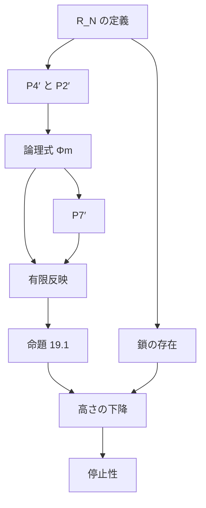

[← Back](../../README.md) | [English](README-en.md) | [Japanese](README.md)

# Σₙ 初等部分構造による、すべての行数のバシク行列システムの停止性の証明

$`r`$ 行のバシク行列の展開（BM4）がいつか必ず止まることを、すべての $`r`$ について Lean 4 で証明した。
ラベルの関係には、Carlson の構造 $`\mathcal{R}_r`$ の関係 $`\lt_1, \dots, \lt_r`$ を使う。

[ペア数列の証明](../pss/README.md)（$`\mathcal{R}_2`$）と [トリオ数列の証明](../tss/README.md)（$`\mathcal{R}_3`$）を、すべての行数に広げた。
新しいのは、有限反映をすべての段で示す部分である。残りはペア数列の証明と同じである。

## 結論

**定理（停止性）.** $`r`$ を任意の自然数、$`A`$ を $`r`$ 行の標準列、$`n : \mathbb{N} \to \mathbb{N}`$ を任意の関数とし、

```math
A_0 = A, \qquad A_{t+1} = A_t[n(t)]
```

と置く。このとき、ある $`T`$ で $`A_T`$ は空である。

**定理（整礎性）.** $`r`$ 行の標準列の上の関係

```math
A \mathrel{R} B \iff B \ne \emptyset \wedge \exists n\ \bigl(A = B[n]\bigr)
```

は整礎である。

Lean の証明に `sorry` は無く、公理は `propext` / `Classical.choice` / `Quot.sound` のみ。行数についての仮定も無い。

## 数学の説明

ペア数列のノートのうち、次を前提にする。

| ノート | 使う内容 |
|---|---|
| [pss 01 順序数と ω₁](../pss/01-ordinals.md) | 無限降下列、後続で閉じる、ω₁ |
| [pss 02 構造と初等部分構造](../pss/02-elementary-substructure.md) | 論理式、Σₙ 初等部分構造、Lean での論理式の表し方 |
| [pss 03 R_N](../pss/03-patterns.md) | $`\mathcal{R}_N`$ の定義と基本性質 |
| [pss 04 R_N の性質 P1〜P7](../pss/04-pattern-properties.md) | P1、P3、P4（段 1、2）、P5、P6、P7 |
| [pss 05 配列、展開、安定ラベル](../pss/05-arrays-labels.md) | ラベルの体系、命題 19.1 |
| [pss 06 有限反映](../pss/06-finite-reflection.md) | §2 コピーの補題、§3 $`n = 0`$、§4 $`n = 1`$ |
| [pss 07 ω₁ の中の閉包と鎖](../pss/07-closure-chains.md) | すべての段で結ばれた鎖 |

すべての行数のためのノート。上から順に読める。

| ノート | 内容 |
|---|---|
| [01 P4′ と P2′](01-cofinal-continuity.md) | すべての段での連続性と閉じ方 |
| [02 論理式 Φₘ](02-phi.md) | 上端との結びつきを中から言う論理式、補題 A、B |
| [03 成分ごとの条件をブロックの形に書く](03-block-form.md) | 使う文が Lean の論理式の形で書けること |
| [04 P7′](04-cofinal-predecessors.md) | 下端では、すべての段で前者が非有界 |
| [05 すべての段の有限反映](05-finite-reflection.md) | 有限反映、ラベルの体系 |
| [06 停止性と整礎性](06-termination.md) | 初期列のラベル、停止性、整礎性 |

## 1. 標準列

```math
S^r_n = \underbrace{(0,\dots,0)}_{r}\,\underbrace{(1,\dots,1)}_{r} \cdots \underbrace{(n,\dots,n)}_{r}
```

**定義.** $`r`$ 行の標準列とは、ある $`S^r_n`$ から展開を有限回して得られる $`r`$ 行の配列のことである。展開規則は BM4 で、[koteitan/dh-bms-wf-formal](https://github.com/koteitan/dh-bms-wf-formal) の展開をそのまま使う。

BM4 の初期列 $`E_r = (0, \dots, 0)(1, \dots, 1)`$ は $`S^r_1`$ なので、$`E_r`$ から展開で得られる行列はすべて $`r`$ 行の標準列である。

## 2. 証明の骨格



## 3. ラベルの関係と有限反映

```math
\lhd_k = \lt_{k+1} \qquad (k \lt r)
```

命題 19.1 がラベルに要求するのは、$`\lhd_k`$ が狭義で推移的であることと、次の有限反映だけである。

**有限反映.** $`n \lt r`$、$`\alpha \lhd_n \beta`$、$`X \subseteq \alpha`$ は有限、$`\alpha \le y_0 \lt \cdots \lt y_{s-1} \lt \beta`$ とする。このとき $`y'_0 \lt \cdots \lt y'_{s-1} \lt \alpha`$ で、次の (a)〜(d) を満たすものがある。

```math
\max X \lt y'_0 \qquad \text{(a)}
```

```math
\forall x \in X\ \forall i \lt s\ \forall k \lt r\ \bigl(x \lhd_k y_i \Rightarrow x \lhd_k y'_i\bigr) \qquad \text{(b)}
```

```math
\forall i, j \lt s\ \forall k \lt r\ \bigl(y_i \lhd_k y_j \Rightarrow y'_i \lhd_k y'_j\bigr) \qquad \text{(c)}
```

```math
\forall i \lt s\ \forall m \lt n\ \bigl(y_i \lhd_m \beta \Rightarrow y'_i \lhd_m \alpha\bigr) \qquad \text{(d)}
```

3 行までは $`n \le 2`$ を個別に示した。すべての行数では、すべての $`n`$ を 1 つの証明で示す（[05](05-finite-reflection.md)）。

**$`n \ge 1`$ の証明の筋.** $`\alpha \lt_{n+1} \beta`$ とし、$`M_i = \{m \lt n : y_i \lt_{m+1} \beta\}`$ と置く。次の $`\Sigma_{n+1}`$ 文を使う。

```math
\sigma = \exists \vec U\ \forall \vec V\ \Bigl(\mathrm{diag}(X, \vec U) = \mathrm{diag}(X, \vec y) \wedge \bigwedge_{i \lt s} \bigl(U_i \le V_i \wedge \Phi_{n-1}(V_i) \Rightarrow \bigwedge_{m \in M_i} U_i \le_{m+1} V_i\bigr)\Bigr)
```

$`\Phi_{n-1}(V_i)`$ は「$`V_i`$ が上端に $`\le_{n-1}`$ で結ばれている」を構造の中から言う $`\Pi_{n-1}`$ 論理式である（[02](02-phi.md)）。

1. $`\beta`$ で真：$`\vec U = \vec y`$。[01](01-cofinal-continuity.md) の系から
2. $`\alpha \lt_{n+1} \beta`$ から $`\alpha`$ でも真。証人を $`\vec y'`$ とすると、原子図式の一致から (a)(b)(c)
3. (d)：P7′ で、$`\alpha`$ の $`\le_{n-1}`$-前者 $`v`$ を非有界に取る。$`\sigma`$ に $`V_i = v`$ を入れて $`y'_i \le_{m+1} v`$。P4′ から $`y'_i \le_{m+1} \alpha`$

## 4. 使う性質

段 1、2 の性質は [pss 04](../pss/04-pattern-properties.md) にある。すべての段に広げたものは次である。$`\le_0`$、$`\le_{-1}`$ は $`\le`$ と読む。

| | 性質 | ノート |
|---|---|---|
| P4′ | $`y \lt \alpha`$、$`S \subseteq [y, \alpha)`$ が $`\alpha`$ で非有界、$`\forall v \in S\ (y \le_j v \wedge v \le_{j-2} \alpha)`$ $`\Rightarrow y \le_j \alpha`$ | [01](01-cofinal-continuity.md) |
| P2′ | $`a \le b \le c`$、$`a \le_m b \le_m c`$、$`a \le_{m+1} c`$ $`\Rightarrow a \le_{m+1} b`$ | [01](01-cofinal-continuity.md) |
| 系 | $`u \le s \le \gamma`$、$`u \le_m \gamma`$、$`s \le_{m-1} \gamma`$ $`\Rightarrow u \le_m s`$ | [01](01-cofinal-continuity.md) |
| 補題 A | $`\gamma`$ が後続で閉じ、$`\gamma \models \Phi_m(u)`$ $`\Rightarrow u \le_m \gamma`$ | [02](02-phi.md) |
| 補題 B | $`u \le_m \gamma`$、$`\forall i \lt m\ \mathrm{Cof}_i(\gamma)`$ $`\Rightarrow \gamma \models \Phi_m(u)`$ | [02](02-phi.md) |
| P7′ | $`\alpha \lt_{m+1} \beta \Rightarrow \forall i \le m\ \mathrm{Cof}_i(\alpha)`$ | [04](04-cofinal-predecessors.md) |

$`\mathrm{Cof}_i(\gamma)`$ は、$`\gamma`$ の $`\le_i`$-前者が $`\gamma`$ で非有界であることをいう。

## 5. 初期列のラベルと停止性

- $`S^r_n`$ には、[pss 07](../pss/07-closure-chains.md) の、すべての段で結ばれた鎖をそのままラベルとして貼る
- 空でない標準列は、命題 19.1 から安定ラベルを持つ
- 展開列が空にならないとすると、命題 19.1 で高さが無限に下がる順序数の列が作れ、順序数の整礎性に反する。これが停止性である
- $`R`$ の無限降下列は展開列の形なので、整礎性は停止性に帰着する

## 6. 形式化していないこと

- **ラベルの大きさ**：ラベルは $`\omega_1`$ の中の閉包で作るので、$`\omega_1`$ 未満であることしか示していない
- **他の版のバシク行列との一致**：扱うのは BM4 の展開規則だけである

## 7. Lean との対応

Lean の段の番号は 1 つずれている（`lev N 0` が $`\le_1`$、`lab N 0` が $`\lt_1`$）。

| 数学 | Lean | ファイル |
|---|---|---|
| P4′ | `elem_cofinal_gen` | [`General.lean`](../../lean/Pattern/General.lean) |
| P2′ | `elem_of_elem_top`, `lev_of_lev_top` | 同上 |
| §4 の系 | `lev_below_top` | 同上 |
| $`\Phi_m`$、$`\mathrm{Cof}_i`$ | `Phi`, `Cof` | 同上 |
| 補題 A、B | `lev_of_phi`, `phi_of_lev` | 同上 |
| 成分ごとの条件のブロックの形 | `skolem_one`, `skolem_two`, `tnMat`, `tn_sig` | 同上 |
| P7′ | `cof_of_lab` | 同上 |
| 有限反映 $`n \ge 1`$ | `reflect_gen` | 同上 |
| ラベルの体系 | `labelSystemGen` | 同上 |
| 有限反映 $`n = 0`$ | `reflect_zero` | [`Reflect.lean`](../../lean/Pattern/Reflect.lean) |
| $`\le_j`$ の定義、P1〜P7 | `lev`, `lab`, `Elem`, `lev0_of_le` など | [`Basic.lean`](../../lean/Pattern/Basic.lean) |
| 鎖の存在 | `lamChain`, `lab_lam` | [`Chain.lean`](../../lean/Pattern/Chain.lean) |
| $`S^r_n`$、標準列 | `stair`, `Std` | [`Main.lean`](../../lean/Pattern/Main.lean) |
| $`S^r_n`$ のラベル | `stable_stair` | 同上 |
| 停止性 | `terminates` | 同上 |
| 整礎性 | `StdR_wf` | 同上 |
| 命題 19.1 | `descent` | [`Bm4/Label.lean`](../../lean/Bm4/Label.lean) |

## 8. ファイル

| ファイル | 行数 | 内容 |
|---|---:|---|
| [`lean/Pattern/Basic.lean`](../../lean/Pattern/Basic.lean) | 454 | $`\mathcal{R}_N`$ の定義と基本性質 |
| [`lean/Pattern/Reflect.lean`](../../lean/Pattern/Reflect.lean) | 329 | 有限反映（$`n = 0, 1, 2`$）、3 行までのラベルの体系 |
| [`lean/Pattern/General.lean`](../../lean/Pattern/General.lean) | 639 | すべての段の有限反映、すべての行数のラベルの体系 |
| [`lean/Pattern/Chain.lean`](../../lean/Pattern/Chain.lean) | 209 | すべての段で結ばれた鎖の存在 |
| [`lean/Pattern/Main.lean`](../../lean/Pattern/Main.lean) | 111 | 標準列の定義、すべての行数の停止性、整礎性 |
| `lean/Bm4/` | 2,923 | BM4 の組合せ部分（配列、展開、コピー補題、命題 19.1） |

## 9. ビルド

Lean 4.30.0 と Mathlib v4.30.0 を使う。

```sh
cd lean
lake exe cache get
lake build
```

## 出典

- T. J. Carlson, Elementary patterns of resemblance, Annals of Pure and Applied Logic 108 (2001).
- G. Wilken, Pure Σ2-elementarity beyond the core, Annals of Pure and Applied Logic 172 (2021). https://doi.org/10.1016/j.apal.2021.103001
- DH, Bashicu Matrix System ver. 4 の停止性と展開関係の整礎性 (2026).
