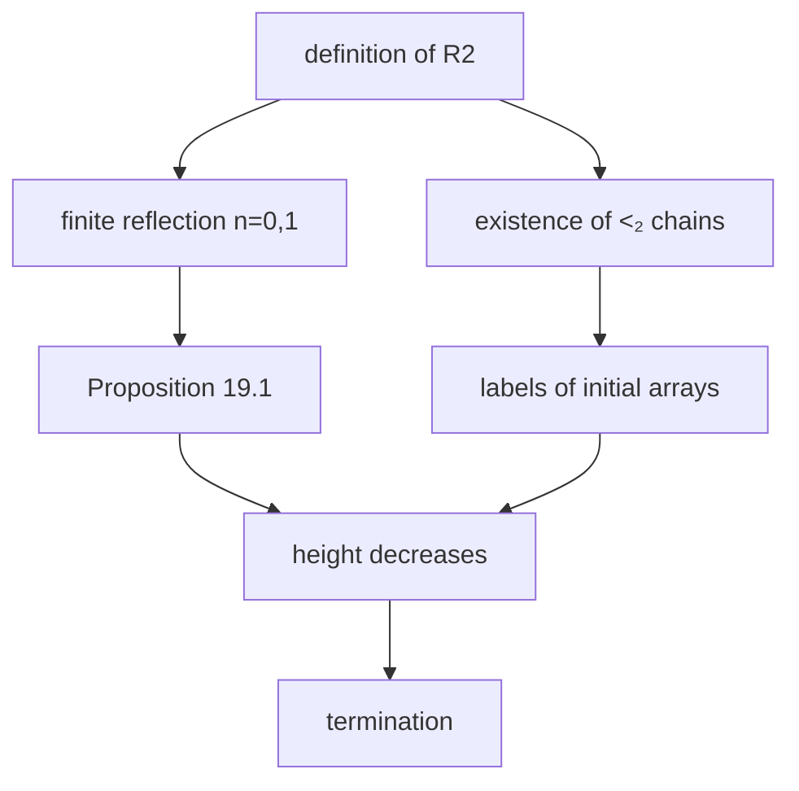

[← Back](../../README-en.md) | [English](README-en.md) | [Japanese](README.md)

# Termination Proof of the Pair Sequence System via Σ₂-Elementary Substructures

We prove in Lean 4 that every expansion of a pair sequence eventually terminates, using the relations of Carlson's structure $`\mathcal{R}_2`$ as the label relations.
The definition of the label relations uses neither the constructible hierarchy nor admissible ordinals.

The extension to 3 rows (trio sequences) is in [tss](../tss/README-en.md), and the extension to every number of rows is in [bms](../bms/README-en.md). The Lean code treats every number of rows together.

## Mathematical background

Notes that explain the mathematics used in the proof, starting from definitions and small examples. They can be read from top to bottom.

| Note | Contents |
|---|---|
| [01 Ordinals and ω₁](en/01-ordinals.md) | Infinite descending sequences, closure under successor, countable ordinals, regularity of ω₁ |
| [02 Structures and elementary substructures](en/02-elementary-substructure.md) | Formulas, preservation upward and downward, Σₙ-elementary substructures, copies, how formulas are represented in Lean |
| [03 R_N](en/03-patterns.md) | Definition, why it is well defined, basic properties, small examples, results from the literature |
| [04 Properties P1–P7 of R_N](en/04-pattern-properties.md) | The seven properties used in finite reflection |
| [05 Arrays, expansion, and stable labels](en/05-arrays-labels.md) | Parents and ancestors, expansion, standard arrays, label systems, Proposition 19.1 |
| [06 Finite reflection](en/06-finite-reflection.md) | Proofs for n = 0, 1, 2 |
| [07 Closure inside ω₁ and chains](en/07-closure-chains.md) | next, λ, chains related at every level |
| [08 Termination and well-foundedness](en/08-termination.md) | Labels of the initial arrays, termination, well-foundedness, size of the labels |

## Result

**Theorem (termination).** Let $`A`$ be a pair sequence and $`n : \mathbb{N} \to \mathbb{N}`$ an arbitrary function, and put

```math
A_0 = A, \qquad A_{t+1} = A_t[n(t)] .
```

Then $`A_T`$ is empty for some $`T`$.

**Theorem (well-foundedness).** The relation on pair sequences

```math
A \mathrel{R} B \iff B \ne \emptyset \wedge \exists n\ \bigl(A = B[n]\bigr)
```

is well-founded.

The Lean proof contains no `sorry`, and the only axioms are `propext` / `Classical.choice` / `Quot.sound`.

## 1. Pair sequences

The expansion rule is the 2-row version of BM4; we use the expansion of [koteitan/dh-bms-wf-formal](https://github.com/koteitan/dh-bms-wf-formal) as it is.

From the initial array $`E_2 = (0,0)(1,1)`$ of BM4 one only reaches arrays below $`\varepsilon_0`$, so we enlarge the initial arrays as follows.

```math
S_n = (0,0)(1,1)\cdots(n,n)
```

**Definition.** A pair sequence is a 2-row array obtained from some $`S_n`$ by finitely many expansions.

## 2. Outline of the proof

As in DH's proof, we attach one ordinal label to each column. On expansion the copies receive labels smaller than the original ones, so the label of the last column (the height) decreases.
The difference from DH is that the label relations $`\lhd_k`$ are given by the relations of $`\mathcal{R}_2`$ instead of elementary substructures of the constructible hierarchy.



## 3. R2

```math
\mathcal{R}_2 = (\mathrm{Ord}; \le, \le_1, \le_2)
```

```math
\alpha \le_i \beta \iff (\alpha; \le, \le_1, \le_2) \preceq_{\Sigma_i} (\beta; \le, \le_1, \le_2) \qquad (i = 1, 2)
```

```math
\alpha \lt_i \beta \iff \alpha \lt \beta \wedge \alpha \le_i \beta
```

$`\le_1`$ and $`\le_2`$ are defined simultaneously by induction on $`\beta`$.

In Lean, formulas are not written as syntax.

- A quantifier-free formula in $`n`$ variables is represented by a set $`D`$ of atomic diagrams of $`n`$-tuples. The atomic diagram of an $`n`$-tuple $`v`$ assigns to each $`a, b \lt n`$ the following triple of truth values.

```math
\mathrm{diag}(v)(a, b) = \bigl( [v_a \le v_b],\ [v_a \le_1 v_b],\ [v_a \le_2 v_b] \bigr)
```

- A $`\Sigma_2`$ formula with parameters $`\vec p`$ is represented in the following form. A $`\Sigma_1`$ formula is the case without the block $`\vec y`$.

```math
M \models \exists \vec x\ \neg\, \exists \vec y\ \neg\, \bigl(\mathrm{diag}(\vec p, \vec x, \vec y) \in D\bigr)
```

Basic properties:

| Property |
|---|
| $`a \le_2 b \Rightarrow a \le_1 b`$ |
| $`\le_1`$ and $`\le_2`$ are transitive |
| $`a \le b \le c \wedge a \le_1 c \Rightarrow a \le_1 b`$ |
| $`y \le \alpha`$, $`\alpha`$ closed under successor, $`\forall v \in [y, \alpha)\ y \le_1 v`$ $`\Rightarrow y \le_1 \alpha`$ |
| $`\alpha \lt_1 \beta \Rightarrow \forall z \lt \alpha\ (z + 1 \lt \alpha)`$ |

## 4. Label relations and finite reflection

```math
\lhd_0 = \lt_1, \qquad \lhd_1 = \lt_2
```

All that Proposition 19.1 requires of the labels is that $`\lhd_k`$ is strict and transitive, together with the following finite reflection.

**Finite reflection.** Let $`n \lt 2`$, $`\alpha \lhd_n \beta`$, $`X \subseteq \alpha`$ finite, and $`\alpha \le y_0 \lt \cdots \lt y_{s-1} \lt \beta`$. Then there are $`y'_0 \lt \cdots \lt y'_{s-1} \lt \alpha`$ satisfying (a)–(d) below.

```math
\max X \lt y'_0 \qquad \text{(a)}
```

```math
\forall x \in X\ \forall i \lt s\ \forall k \lt 2\ \bigl(x \lhd_k y_i \Rightarrow x \lhd_k y'_i\bigr) \qquad \text{(b)}
```

```math
\forall i, j \lt s\ \forall k \lt 2\ \bigl(y_i \lhd_k y_j \Rightarrow y'_i \lhd_k y'_j\bigr) \qquad \text{(c)}
```

```math
\forall i \lt s\ \forall m \lt n\ \bigl(y_i \lhd_m \beta \Rightarrow y'_i \lhd_m \alpha\bigr) \qquad \text{(d)}
```

**Case $`n = 0`$.** The $`\Sigma_1`$ sentence "above $`X`$ there is a tuple of points with the same atomic diagram as $`X \cup Y`$" is true in $`\beta`$, hence true in $`\alpha`$ by $`\alpha \lt_1 \beta`$. Its witness is $`y'`$, and (a)(b)(c) follow because the atomic diagrams agree. (d) is vacuous since $`m \lt 0`$.

**Case $`n = 1`$.** Add to the sentence above, for each $`i`$ with $`y_i \lt_1 \beta`$,

```math
\forall v_i\ \bigl(u_i \le v_i \Rightarrow u_i \le_1 v_i\bigr)
```

and use the resulting $`\Sigma_2`$ sentence.

1. True in $`\beta`$: from $`y_i \le_1 \beta`$ and $`y_i \le v \lt \beta`$ we get $`y_i \le_1 v`$
2. By $`\alpha \lt_2 \beta`$ it is also true in $`\alpha`$. The witness $`u_i = y'_i`$ satisfies $`y'_i \le_1 v`$ for all $`v \in [y'_i, \alpha)`$
3. Since $`\alpha`$ is closed under successor, continuity gives $`y'_i \lt_1 \alpha`$. This is (d)

This is the same content as Lemma 1.7 of Wilken's paper "Pure Σ2-elementarity beyond the core".

## 5. Labels of the initial arrays

On $`S_n`$ we put a $`\lt_2`$ chain of length $`n+1`$

```math
c_0 \lt_2 c_1 \lt_2 \cdots \lt_2 c_n
```

as the labels. Every pair of columns is related by $`\lt_2`$, and $`\lt_2 \subseteq \lt_1`$, so the ancestor relations of both row 0 and row 1 are respected.

The existence of $`\lt_2`$ chains is shown by a closure inside $`\omega_1`$.

For each sentence true in $`\omega_1`$ with parameters below $`\gamma`$, choose one witness of its first block and take the supremum of (component $`+1`$) over all of them. Let $`\mathrm{next}(\gamma)`$ be the larger of this and $`\gamma`$, plus $`1`$.

```math
\lambda(\gamma) = \sup_{t \lt \omega} \mathrm{next}^t(\gamma)
```

Then the following hold.

```math
\gamma \lt \omega_1 \Rightarrow \gamma \lt \lambda(\gamma) \lt \omega_1
```

- If $`\gamma \lt \omega_1`$, then every sentence with parameters below $`\lambda(\gamma)`$ has the same truth value in $`\lambda(\gamma)`$ and in $`\omega_1`$

```math
\gamma, \delta \lt \omega_1 \wedge \lambda(\gamma) \lt \lambda(\delta) \Rightarrow \lambda(\gamma) \lt_2 \lambda(\delta)
```

```math
\lambda(0) \lt_2 \lambda(\lambda(0)) \lt_2 \lambda(\lambda(\lambda(0))) \lt_2 \cdots
```

- $`\mathrm{next}(\gamma) \lt \omega_1`$ because the set of pairs of a formula and parameters is countable, so the supremum of the witnesses is a countable supremum of ordinals below $`\omega_1`$
- The agreement of truth values is proved by induction on the number of blocks. The witnesses of the first block of a sentence true in $`\omega_1`$ lie inside $`\lambda(\gamma)`$
- $`\lambda(\gamma) \lt_2 \lambda(\delta)`$ follows because both agree with $`\omega_1`$ on the truth values of sentences

## 6. Descent of the height and termination

For an array $`A`$ of length $`\ell`$ with a label $`f`$, put $`\mathrm{ht}(f) = f(\ell - 1)`$.

**Proposition 19.1 (DH).** Let $`A`$ be a nonempty array with a stable label $`f`$ and $`N \in \mathbb{N}`$. If $`A[N]`$ is nonempty, then $`A[N]`$ has a stable label $`g`$ with

```math
\mathrm{ht}(g) \lt \mathrm{ht}(f) .
```

This was proved in dh-bms-wf-formal assuming finite reflection, and we use it as it is.

- Every nonempty pair sequence has a stable label. Use §5 for the initial arrays and Proposition 19.1 for expansions
- If an expansion sequence never becomes empty, Proposition 19.1 produces an infinite descending sequence of heights, contradicting the well-foundedness of the ordinals. This is termination
- An infinite descending sequence of $`R`$ has the form of an expansion sequence, so well-foundedness reduces to termination

## 7. What is not formalized

- **The labels being small**
  - The Lean proof builds the $`\lt_2`$ chains by a closure inside $`\omega_1`$, so it does not show how large the labels are
  - According to Wilken, the least ordinal below which finite $`\le_2`$ chains of arbitrary length exist is $`\psi_0(\Omega_\omega)`$, the proof-theoretic ordinal of $`\Pi^1_1\text{-}\mathrm{CA}_0`$ (introduction of "Tracking chains revisited" below). Hence the labels can be taken as recursive ordinals below $`\psi_0(\Omega_\omega)`$, which are not admissible
  - This fact is not formalized
- **Agreement with other versions of pair sequences**: only the 2-row version of BM4 is treated
- **3 or more rows**
  - With 3 rows, (d) gains the condition $`y_i \lt_2 \beta \Rightarrow y'_i \lt_2 \alpha`$ for $`m = 1`$
  - It can be shown using $`\mathcal{R}_3`$; see [tss](../tss/README-en.md)
  - Every number of rows can be shown using $`\mathcal{R}_r`$; see [bms](../bms/README-en.md)

## 8. Correspondence with Lean

In Lean, $`\mathcal{R}_N`$ is defined for general $`N`$. Pair sequences are the case $`N = 2`$.

| Mathematics | Lean | File |
|---|---|---|
| Definition of $`\le_1`$, $`\le_2`$ | `RFix`, `RN`, `lev`, `lev_iff` | [`Basic.lean`](../../lean/Pattern/Basic.lean) |
| $`\lt_1`$, $`\lt_2`$ | `lab` | same |
| Formulas, atomic diagrams | `Sig`, `diag`, `Elem` | same |
| Transitivity, $`\le_2 \Rightarrow \le_1`$ | `lev_trans`, `lev_mono` | same |
| $`a \le b \le c \wedge a \le_1 c \Rightarrow a \le_1 b`$ | `lev0_of_le` | same |
| Continuity | `lev0_of_forall` | same |
| $`\alpha \lt_1 \beta`$ implies closure under successor | `succ_lt_of_lab0` | same |
| Finite reflection $`n = 0`$ | `reflect_zero` | [`Reflect.lean`](../../lean/Pattern/Reflect.lean) |
| Finite reflection $`n = 1`$ | `reflect_one` | same |
| Label system (up to 3 rows) | `labelSystem` | same |
| Label system (every number of rows) | `labelSystemGen` | [`General.lean`](../../lean/Pattern/General.lean) |
| $`\mathrm{next}`$, $`\lambda`$ | `next`, `lam` | [`Chain.lean`](../../lean/Pattern/Chain.lean) |
| Agreement of $`\lambda(\gamma)`$ and $`\omega_1`$ | `lam_elem` | same |
| $`\lambda(\gamma) \lt_2 \lambda(\delta)`$ | `lab_lam` | same |
| Existence of chains | `exists_chain` | same |
| $`S_n`$, pair sequences | `stair`, `Std` | [`Main.lean`](../../lean/Pattern/Main.lean) |
| Labels of $`S_n`$ | `stable_stair` | same |
| Labels of nonempty pair sequences | `std_stable` | same |
| Termination | `pss_terminates` (general form `terminates`) | same |
| Well-foundedness | `StdR_wf` | same |
| Proposition 19.1 | `descent` | [`Bm4/Label.lean`](../../lean/Bm4/Label.lean) |

## 9. Files

| File | Lines | Contents |
|---|---:|---|
| [`lean/Pattern/Basic.lean`](../../lean/Pattern/Basic.lean) | 454 | Definition and basic properties of $`\mathcal{R}_N`$ |
| [`lean/Pattern/Reflect.lean`](../../lean/Pattern/Reflect.lean) | 329 | Finite reflection ($`n = 0, 1, 2`$), label system |
| [`lean/Pattern/Chain.lean`](../../lean/Pattern/Chain.lean) | 209 | Existence of chains related at every level |
| [`lean/Pattern/General.lean`](../../lean/Pattern/General.lean) | 639 | Finite reflection at every level ([bms](../bms/README-en.md)) |
| [`lean/Pattern/Main.lean`](../../lean/Pattern/Main.lean) | 111 | Definition of standard arrays, termination and well-foundedness for every number of rows |
| `lean/Bm4/` | 2,923 | Combinatorics of BM4 (arrays, expansion, copy lemmas, Proposition 19.1) |

`lean/Bm4/` copies only the combinatorial part of `lean/Bm4/` in [koteitan/dh-bms-wf-formal](https://github.com/koteitan/dh-bms-wf-formal).
The only change is the label interface in `Label.lean`.

- The number of rows $`r`$ is a parameter of the interface, and finite reflection is required only for $`n \lt r`$
- The unused monotonicity condition and the initial-pair condition, used only for the initial array $`E_r`$, are removed

The levels $`n \lt r`$ of finite reflection that are needed depend on the number of rows, so the number of rows is a parameter of the interface.

## 10. Build

Lean 4.30.0 and Mathlib v4.30.0 are used.

```sh
cd lean
lake exe cache get
lake build
```

## Sources

- G. Wilken, Pure Σ2-elementarity beyond the core, Annals of Pure and Applied Logic 172 (2021). https://doi.org/10.1016/j.apal.2021.103001
- G. Wilken, Tracking chains revisited. https://arxiv.org/abs/1611.04348
- G. Wilken, Pure patterns of order 2. https://arxiv.org/abs/1608.08421
- T. J. Carlson and G. Wilken, Tracking chains of Σ2-elementarity, Annals of Pure and Applied Logic 163 (2012).
